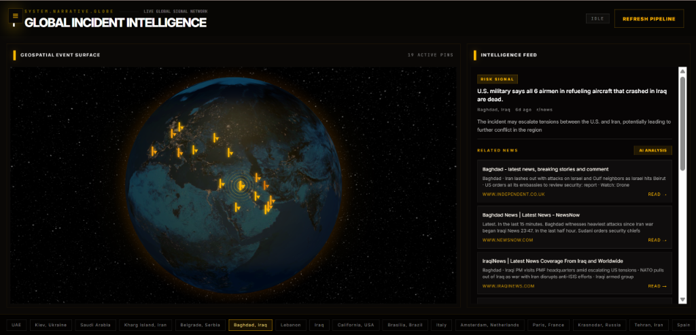
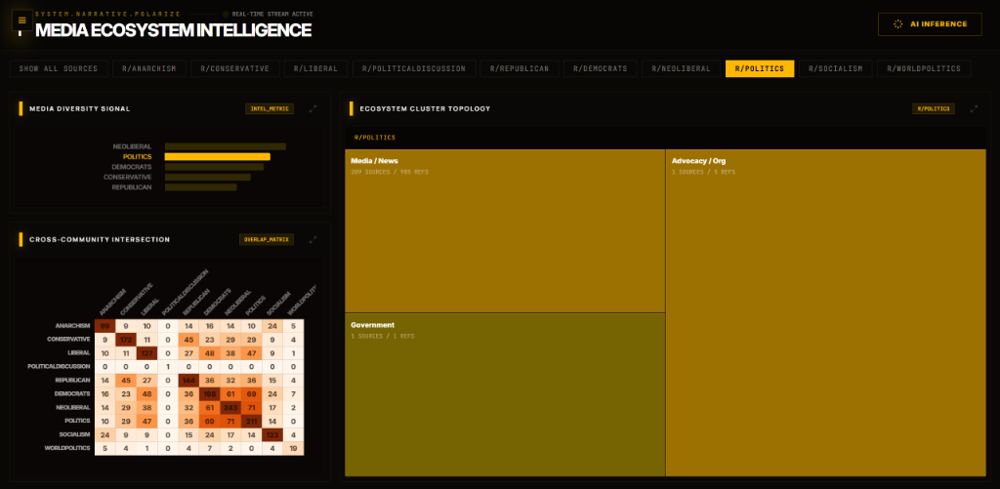
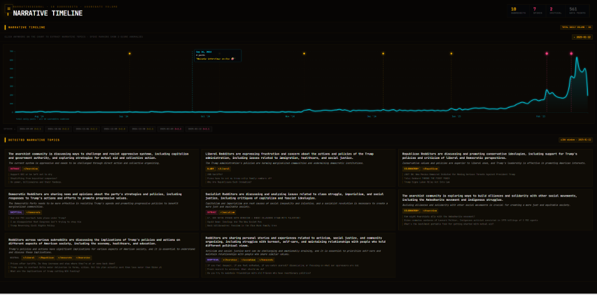
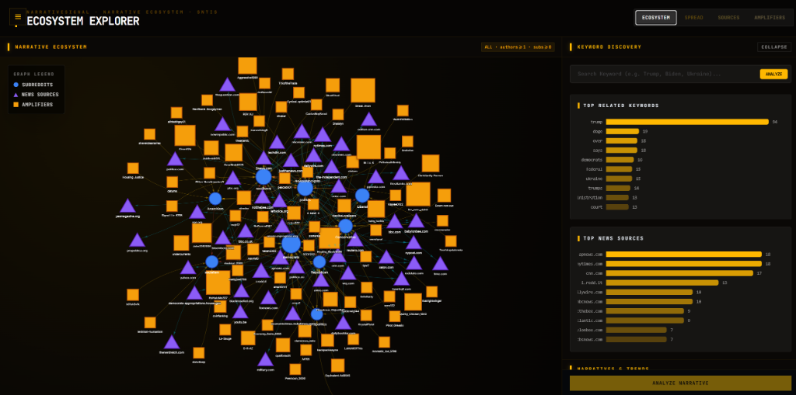
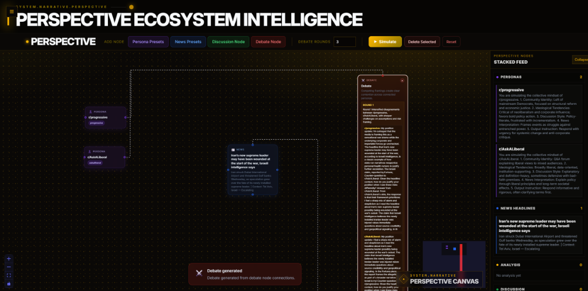
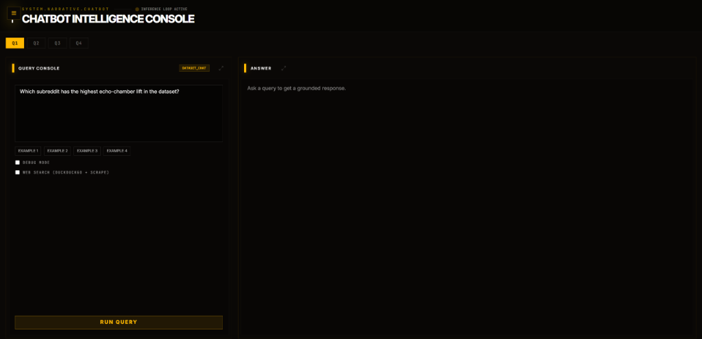

# 🧠 Narrative Intelligence Platform

> Transforming raw Reddit discussions into structured, explainable intelligence.

---

## 🎥 Demo & Overview

Online discussions today are not purely organic — they are shaped by narratives, biases, and amplification across communities. This platform converts unstructured Reddit data into **actionable intelligence** by analyzing how information emerges, spreads, and evolves.

👉 **[Watch the full demo here](https://youtu.be/qKnDmuBMlOY)**

> [!TIP]
> **Best Viewing Experience**: Set your browser zoom to **80%** for the most immersive and accurate display of the intelligence dashboards and network graphs.

---

## 🧩 Core Features

### 🌍 Global Incident Intelligence
- Clusters Reddit + news signals into real-world events.
- Tracks escalation patterns and generates AI-powered intelligence reports.

### 📈 Narrative Timeline
- Detects surges in attention using statistical anomaly detection.
- Identifies and explains the underlying narratives driving specific spikes.

### 🕸️ Ecosystem & Network Graph
- Models information flow between subreddits.
- Identifies key players: **Sources**, **Bridges**, and **Amplifiers**.

### 🎭 Perspective Simulation
- Persona-based modeling to predict community reactions.
- Uses multi-round debate and discussion nodes to simulate narrative evolution.

### 🤖 Interactive Intelligence Console
- **Multi-Agent RAG**: A sophisticated Reasoning-over-Evidence layer that uses multiple AI agents to validate claims.
- **Hybrid Search**: Seamlessly combines structured SQL queries (DuckDB) and Vector embeddings for grounded, factual answers.
- **Web-Augmented**: Integrated web search capabilities to stay current with breaking news and external context.

---

## 🏗️ System Architecture

```text
            ┌──────────────────────┐
            │   Reddit + News Data │
            └──────────┬───────────┘
                       │
                       ▼
            ┌──────────────────────┐
            │   Data Processing    │
            │  (Cleaning + Parsing)│
            └──────────┬───────────┘
                       │
                       ▼
            ┌──────────────────────┐
            │  Feature Engineering │
            │  - Domains & Topics  │
            │  - Growth Metrics    │
            └──────────┬───────────┘
                       │
    ┌──────────────────┼──────────────────┐
    ▼                  ▼                  ▼
┌──────────────┐ ┌──────────────┐ ┌──────────────┐
│  Timeline    │ │    Graph     │ │  Ecosystem   │
│  Analysis    │ │   Modeling   │ │  Analysis    │
└──────┬───────┘ └──────┬───────┘ └──────┬───────┘
       ▼                ▼                ▼
┌────────────────────────────────────────────────┐
│                RAG + AI Layer                  │
│           (Reasoning over Evidence)            │
└───────────────────────┬────────────────────────┘
                        ▼
            ┌──────────────────────┐
            │  UI / Visualization  │
            └──────────────────────┘
```

---

## 🔁 The Intelligence Pipeline

1.  **Ingestion**: Aggregates Reddit metadata and news signals.
2.  **Detection**: Uses rolling Z-scores for spike detection and clustering for event identification.
3.  **Analysis**: Measures "information diets" through domain diversity and echo chamber metrics.
4.  **Reasoning**: A RAG layer ensures the AI produces grounded insights rather than hallucinations.
5.  **Simulation**: Persona-based nodes predict how narratives might evolve across different ideological groups.

---

## ⚙️ Tech Stack

### Frontend
- **Framework**: Next.js 14, React
- **Styling**: Tailwind CSS, Framer Motion (Animations)
- **Visualizations**: D3.js, Recharts, React Flow
- **Geospatial**: CesiumJS / Resium

### Backend
- **Engine**: Python 3.11+, FastAPI
- **Database**: DuckDB (for high-performance analytical queries)
- **Processing**: Pandas, NumPy, PyArrow (Parquet)

### AI & LLM
- **Orchestration**: LangChain, Multi-Agent Systems
- **Models**: Groq (Llama 3), Gemini, LiteLLM
- **Intelligence**: Retrieval-Augmented Generation (RAG)

### Deployment
- **Platform**: Vercel (Unified Frontend & Serverless Backend)

---

## 📸 Screenshots

### Global Intelligence


### Media Ecosystem


### Narrative Timeline


### Graph Analysis


### Perspective Simulation


### Chatbot Intelligence


---

## 🧪 Case Study

This system was used to analyze political subreddits and observe how narratives differ across:

- r/democrats
- r/republican
- r/socialism
- r/neoliberal

**Key Insight:**
Different communities consume different media sources and frame the same events differently, leading to distinct narrative ecosystems.

---

## 🏁 Conclusion

This platform demonstrates how raw, chaotic social data can be transformed into structured insights and predictive simulations. In the modern information landscape, the real power isn't just having data—**it's understanding the mechanics of how it spreads.**

---
*Created for the Research Engineering Intern Assignment.*
